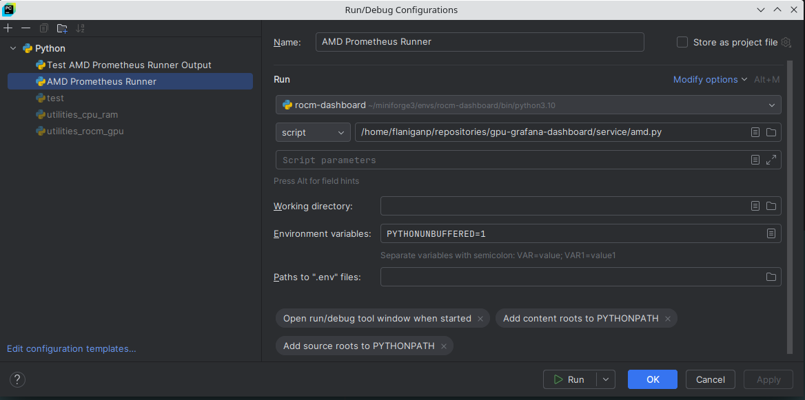
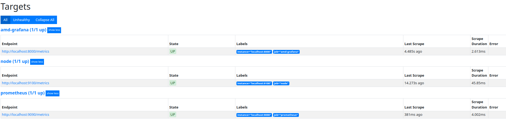
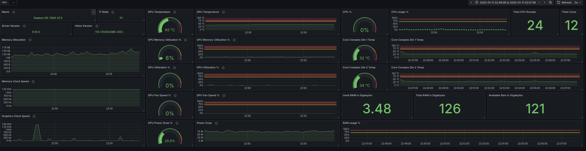

# TBD
nvidia dashboard requires rework as I originally did not write the directions out fully (sorry!), will do that when I get the chance. Right now I am focused on my AMD machine.

If you are wanting to have a functional dashboard for nvidia go [here](github.com/utkuozdemir/nvidia_gpu_exporter). As this is where I reverse engineered my AMD dashboard from.

# GPU Dashboard
Prometheus and Grafana are cornerstone tools in modern infrastructure for monitoring and visualization, offering deep 
insights into system performance and health. Prometheus specializes in data collection and alerting, providing a robust 
query language, while Grafana excels in data visualization, allowing for the creation of detailed dashboards from 
multiple data sources. Together, they form a powerful toolkit for real-time monitoring and analysis, essential for 
maintaining system reliability and performance.

## Prometheus:
Open-source monitoring system designed for reliability and efficiency.

Features:
      * Dimensional data model: Supports time series data identified by metric name and key/value pairs.
      * PromQL: A powerful query language for data analysis and aggregation.
      * Autonomous single server nodes: No dependence on distributed storage.
      * Service discovery: Automates the discovery of monitoring targets.
      * Pull-based collection: Simplifies configuration and ensures up-to-date data.

## Grafana:
Open-source visualization and analytics software, perfect for creating interactive dashboards.

Features:
      * Rich visualization options: Supports various graph, table and panel formats.
      * Dynamic Dashboards: Enhances user interaction with template variables.
      * Mixed Data Sources: Integrates data from Prometheus and other sources seamlessly.
      * Extensible: Supports plugins for additional data sources and visualizations.
      * Advanced alerting: Offers comprehensive alerting and notification systems.

## Synergy:

  * Comprehensive Monitoring: Offering a complete monitoring solution, from data collection to detailed visualization.
  * Real-Time Insights: Enable real-time performance and health monitoring of systems and applications.
  * Problem Diagnosis and Alerting: Facilitate quick identification of issues and alerting for immediate action.
  * Customizable and Scalable: Meet the needs of small projects to large-scale enterprise environments.

By leveraging Prometheus for its robust monitoring and alerting capabilities alongside Grafana for its advanced 
visualization features, teams can achieve a deep understanding of their systems' operational state, ensuring optimal 
performance and reliability.

## NVIDIA-SMI and ROCm-SMI Integration with Prometheus and Grafana

NVIDIA-SMI (NVIDIA System Management Interface) and ROCm-SMI (Radeon Open Compute System Management Interface) are 
command-line utilities designed for monitoring and managing hardware functionalities of NVIDIA and AMD GPUs, 
respectively. These tools provide critical insights into the performance, temperature, power usage, and other key 
metrics of GPUs, making them indispensable for system administrators, developers, and data scientists working in 
GPU-intensive environments. Integrating NVIDIA-SMI and ROCm-SMI with Prometheus and Grafana offers a unified interface 
for real-time hardware monitoring, enhancing system performance and reliability.

## Implementation:

To achieve this integration, users need to set up Prometheus to scrape GPU metrics exposed by custom exporters for 
NVIDIA-SMI and ROCm-SMI. Grafana can then connect to Prometheus as a data source, allowing users to create dashboards 
that visualize these metrics in real-time. This setup empowers users to monitor their GPU hardware efficiently, ensuring
optimal performance and longevity of their devices.

1. Add Grafana's GPG key and repository
```bash
wget -q -O - https://apt.grafana.com/gpg.key | gpg --dearmor | sudo tee /etc/apt/keyrings/grafana.gpg > /dev/null
```

2. Add the Grafana repository to your system's software sources
```bash
echo "deb [signed-by=/etc/apt/keyrings/grafana.gpg] https://apt.grafana.com stable main" | sudo tee -a /etc/apt/sources.list.d/grafana.list
```

3. Update your package lists
```bash
sudo apt-get update
```

4. Install Grafana
```bash
sudo apt-get install grafana
```

5. Start grafana server
```bash
sudo systemctl start grafana-server
```

6. Enable Grafana to start at boot
```bash
sudo systemctl enable grafana-server
```

7. Get the status of grafana-server
```bash
(rocm-dashboard) flaniganp@amd-server-gpu:~/repositories/gpu-grafana-dashboard$ sudo systemctl status grafana-server
[sudo] password for flaniganp: 
● grafana-server.service - Grafana instance
     Loaded: loaded (/lib/systemd/system/grafana-server.service; enabled; vendor preset: enabled)
     Active: active (running) since Sun 2025-01-12 19:10:53 EST; 5min ago
       Docs: http://docs.grafana.org
   Main PID: 1566 (grafana)
      Tasks: 39 (limit: 154273)
     Memory: 200.1M
        CPU: 851ms
     CGroup: /system.slice/grafana-server.service
             └─1566 /usr/share/grafana/bin/grafana server --config=/etc/grafana/grafana.ini --pidfile=/run/grafana/grafana-server.pid --packaging=deb cfg:default.paths.logs=/var/log/grafana cfg:default.paths.data=/var/lib/grafana cfg:default.paths.plugins=/var/lib/grafana/plugins cfg:default.paths.provisio>

Jan 12 19:10:53 amd-server-gpu grafana[1566]: logger=provisioning.dashboard t=2025-01-12T19:10:53.842268537-05:00 level=info msg="finished to provision dashboards"
Jan 12 19:10:53 amd-server-gpu grafana[1566]: logger=ngalert.state.manager t=2025-01-12T19:10:53.842488047-05:00 level=info msg="State cache has been initialized" states=0 duration=94.866985ms
Jan 12 19:10:53 amd-server-gpu grafana[1566]: logger=ngalert.scheduler t=2025-01-12T19:10:53.842520067-05:00 level=info msg="Starting scheduler" tickInterval=10s maxAttempts=1
Jan 12 19:10:53 amd-server-gpu grafana[1566]: logger=ticker t=2025-01-12T19:10:53.842734917-05:00 level=info msg=starting first_tick=2025-01-12T19:11:00-05:00
Jan 12 19:10:53 amd-server-gpu grafana[1566]: logger=plugins.update.checker t=2025-01-12T19:10:53.88560546-05:00 level=info msg="Update check succeeded" duration=137.977398ms
Jan 12 19:10:53 amd-server-gpu grafana[1566]: logger=grafana.update.checker t=2025-01-12T19:10:53.88573269-05:00 level=info msg="Update check succeeded" duration=138.303448ms
Jan 12 19:10:53 amd-server-gpu grafana[1566]: logger=grafana-apiserver t=2025-01-12T19:10:53.890892579-05:00 level=info msg="Adding GroupVersion iam.grafana.app v0alpha1 to ResourceManager"
Jan 12 19:10:53 amd-server-gpu grafana[1566]: logger=grafana-apiserver t=2025-01-12T19:10:53.891214299-05:00 level=info msg="Adding GroupVersion playlist.grafana.app v0alpha1 to ResourceManager"
Jan 12 19:10:53 amd-server-gpu grafana[1566]: logger=grafana-apiserver t=2025-01-12T19:10:53.891479029-05:00 level=info msg="Adding GroupVersion featuretoggle.grafana.app v0alpha1 to ResourceManager"
Jan 12 19:12:39 amd-server-gpu
```

8. Install Prometheus
```bash
sudo apt-get install prometheus -y
```

9. Start the Prometheus service
```bash
sudo systemctl start prometheus
```

10. Enable Prometheus to start at boot
```bash
sudo systemctl enable prometheus
```

11. Update Prometheus Configuration (amd or nvidia)
```bash
sudo cp prometheus/[amd|nvidia].yml /etc/prometheus/prometheus.yml
```

12. Reload Prometheus to apply the configuration changes
```bash
sudo systemctl reload prometheus
```

13. Check the status of Prometheus to ensure it is running as expected
```bash
sudo systemctl status prometheus
```

Result:
```bash
(rocm-dashboard) flaniganp@amd-server-gpu:~/repositories/gpu-grafana-dashboard$ sudo systemctl status prometheus
● prometheus.service - Monitoring system and time series database
     Loaded: loaded (/lib/systemd/system/prometheus.service; enabled; vendor preset: enabled)
     Active: active (running) since Sun 2025-01-12 19:10:51 EST; 5min ago
       Docs: https://prometheus.io/docs/introduction/overview/
             man:prometheus(1)
   Main PID: 1060 (prometheus)
      Tasks: 30 (limit: 154273)
     Memory: 90.4M
        CPU: 1.592s
     CGroup: /system.slice/prometheus.service
             └─1060 /usr/bin/prometheus

Jan 12 19:10:51 amd-server-gpu prometheus[1060]: ts=2025-01-13T00:10:51.431Z caller=main.go:795 level=info msg="Server is ready to receive web requests."
Jan 12 19:10:57 amd-server-gpu prometheus[1060]: ts=2025-01-13T00:10:57.886Z caller=compact.go:518 level=info component=tsdb msg="write block" mint=1736647200000 maxt=1736654400000 ulid=01JHEFZNBRT5EJHH3HH6F3B9A4 duration=101.829054ms
Jan 12 19:10:57 amd-server-gpu prometheus[1060]: ts=2025-01-13T00:10:57.890Z caller=head.go:805 level=info component=tsdb msg="Head GC completed" duration=2.49413ms
Jan 12 19:10:58 amd-server-gpu prometheus[1060]: ts=2025-01-13T00:10:58.001Z caller=compact.go:518 level=info component=tsdb msg="write block" mint=1736654402775 maxt=1736661600000 ulid=01JHEFZNFS5MNRHD9C4YNHBTRW duration=87.966706ms
Jan 12 19:10:58 amd-server-gpu prometheus[1060]: ts=2025-01-13T00:10:58.005Z caller=head.go:805 level=info component=tsdb msg="Head GC completed" duration=3.45315ms
Jan 12 19:10:58 amd-server-gpu prometheus[1060]: ts=2025-01-13T00:10:58.006Z caller=checkpoint.go:97 level=info component=tsdb msg="Creating checkpoint" from_segment=5 to_segment=9 mint=1736661600000
Jan 12 19:10:58 amd-server-gpu prometheus[1060]: ts=2025-01-13T00:10:58.080Z caller=head.go:974 level=info component=tsdb msg="WAL checkpoint complete" first=5 last=9 duration=74.305788ms
Jan 12 19:10:58 amd-server-gpu prometheus[1060]: ts=2025-01-13T00:10:58.193Z caller=compact.go:459 level=info component=tsdb msg="compact blocks" count=2 mint=1736559423879 maxt=1736568000000 ulid=01JHEFZNN13E2GZ723QJYT4ASG sources="[01JHBXRQXSHA33MH4M1KE4KXS7 01JHBXRR0QW79YJ66Y42GZ17HH]" duration=112.4592>
Jan 12 19:10:58 amd-server-gpu prometheus[1060]: ts=2025-01-13T00:10:58.199Z caller=db.go:1293 level=info component=tsdb msg="Deleting obsolete block" block=01JHBXRQXSHA33MH4M1KE4KXS7
Jan 12 19:10:58 amd-server-gpu prometheus[1060]: ts=2025-01-13T00:10:58.205Z caller=db.go:1293 level=info component=tsdb msg="Deleting obsolete block" block=01JHBXRR0QW79YJ66Y42GZ17HH
lines 1-22/22 (END)
```

14. I used Pycharm, below is the version and setup window.
```bash
PyCharm 2024.3.1 (Community Edition)
Build #PC-243.22562.180, built on December 11, 2024
Runtime version: 21.0.5+8-b631.28 amd64 (JCEF 122.1.9)
VM: OpenJDK 64-Bit Server VM by JetBrains s.r.o.
Toolkit: sun.awt.X11.XToolkit
Linux 6.8.0-51-generic
GC: G1 Young Generation, G1 Concurrent GC, G1 Old Generation
Memory: 15000M
Cores: 24
Registry:
  ide.experimental.ui=true
  i18n.locale=
  llm.show.ai.promotion.window.on.start=false
Current Desktop: KDE
```



15. Go to `http://localhost:9090/classic/targets` and check for [amd|nvidia]-grafana it should display (give it a minute if you just started). `amd-grafana (1/1 up)` should display.


16. Go to `http://localhost:3000/` and loging with default username (admin) and password (admin). You are then prompted to change your password. 

17. Navigate to the hamburger menu on top left then go to Dashboards.

18. Select `New` then `Import Dashboard` and copy the content from dashboards/[amd|nvidia].json, then select `Load`.

19. Review the Options, I left it at its default for `Name` AMD GPU Metrics, `Folder` Dashboard and `UUID` of vlvPlrgnk, then select `Import`.

20. I got the following without any additional configuration for `amd-dashboard`.
